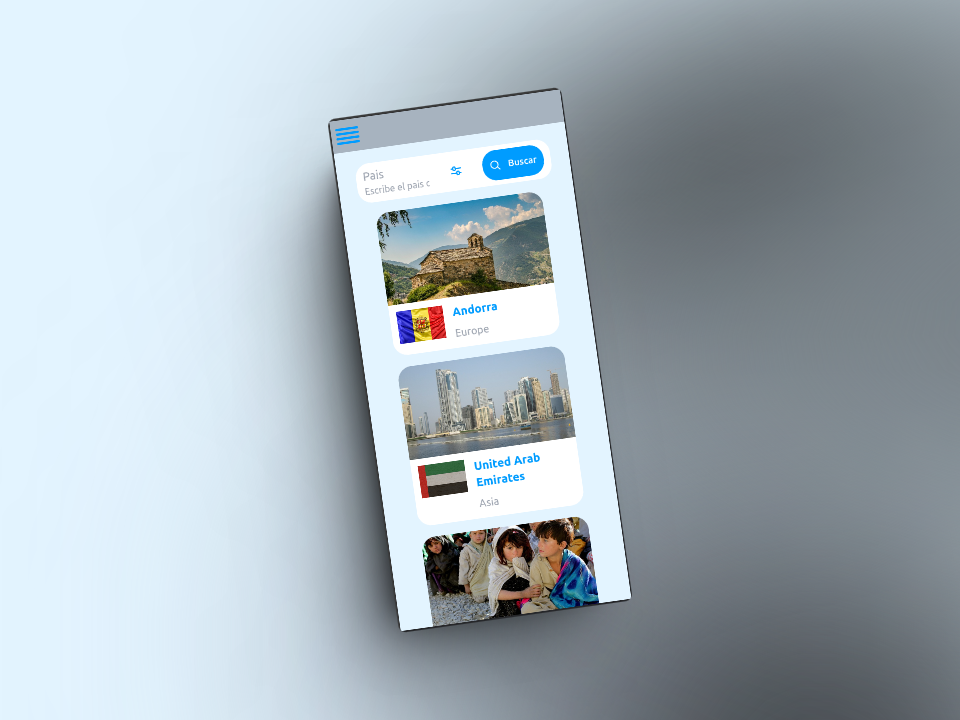
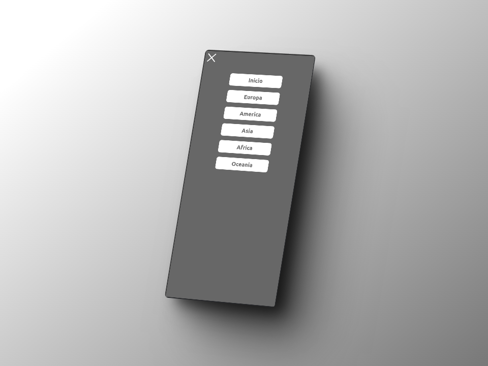
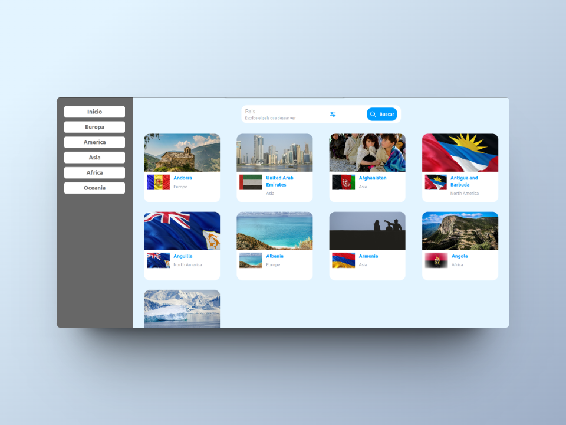
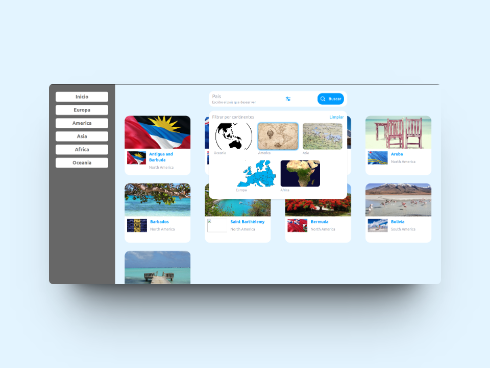

# Fractal Challenge

Este reto tecnico fue realizado con React, Apollo Client y Css modules. Las APIs usadas fueron de [GraphQL](https://countries.trevorblades.com/) y [REST](https://pixabay.com/api/docs/)(Pixabay).

Esta aplicacion consiste en mostrar los diferentes paises de cada continente, poder filtrar por continente y poder buscarlos por su nombre.
Al hacer click podemos ver los detalles de ese pais como su moneda, poblacion, capital,etc.
## Requerimientos

- Utilizar un framwork de JavaScript moderno, preferiblemente Vue 2 Options API.
- Emplear Apollo Client (o una biblioteca similar) para realizar solicitudes GraphQL al API proporcionado.
- Implementar routing adecuado para la navegación entre las vistas de los países y la barra de búsqueda.
- Utilizar alguna biblioteca o método para hacer la interfaz responsive y adaptable a diferentes tamaños de pantalla.
- Utilizar alguna API (GraphQL o REST) para obtener imágenes correspondientes a cada país.

### Diseño

## Built With

- [React.js](https://nextjs.org/)
- [TypeScript](https://www.typescriptlang.org/)
- [Tailwind](https://tailwindcss.com/)
- [Apolo Client](https://www.apollographql.com/docs/react/)
- [Pixabay](https://pixabay.com/es/service/about/api/)
- [Vercel](https://vercel.com/)
